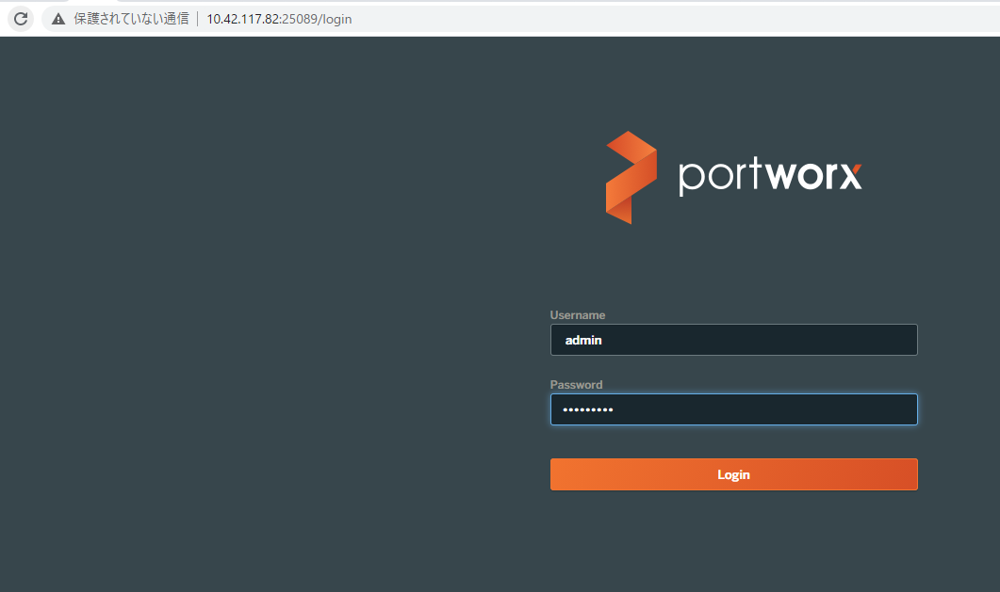
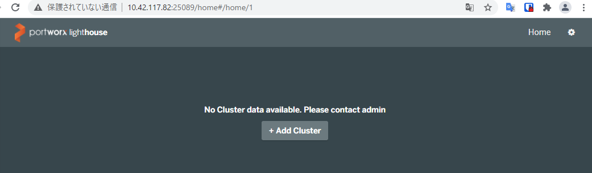
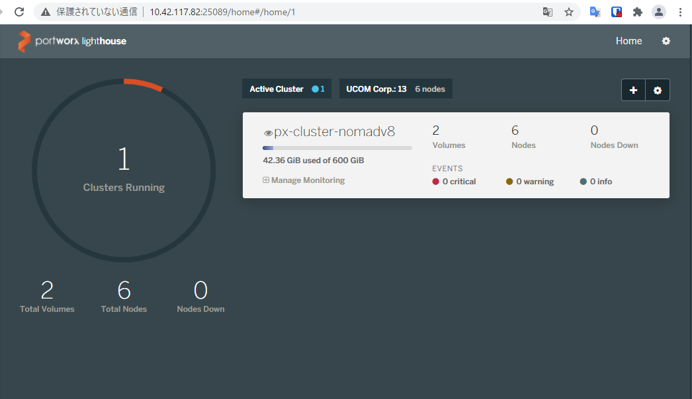

# Hashiporx deploy

HashiStack (Vault+Consul+Nomad)環境にPortworxを構成し、Hashiporx環境をデプロイします。  
デプロイする環境はオンプレミスのvSphere環境が想定されており、事前にOSテンプレートを作成しておく必要があります。

## os template
- CentOS 7.9 を利用
- 最小インストール

## デプロイ環境 
- vSphere 6.7

## vm
下記のVMをTerraformを使ってデプロイします。
環境に合わせてtfvarsを変更することができます。**Consul & Nomad & Portworx node** はメモリが少なすぎると動作しない場合があります（未調査）

### Vault Server
- cpu: 4
- mem: 4GB
- Disk: 
  - 1: 120GB

### Consul & Nomad & Portworx node
- cpu: 8
- mem: 16GB
- Disk: 
  - 1: 120GB
  - 2: 100GB
    - 2のDiskはPortworxで利用するためRAW Diskとしてマウントしておくこと
    - Terraformで2のDisk追加は可能なので、OSテンプレート作成時には構成不要  


## デプロイ方法  

### os templateの作成  
vSphere上にOSテンプレートを作成します。
今回利用したOSは下記です。  

```
# cat /etc/centos-release
CentOS Linux release 7.9.2009 (Core)
```

最小でインストールしています。
OSを構成後、vSphere上にテンプレート化しておきます。  

### Terraformのインストール  
環境をデプロイするために [terradorm](https://www.terraform.io/)を利用します。  
環境にあったterraformをインストールしておきます。  

[Install Terraform](https://learn.hashicorp.com/tutorials/terraform/install-cli)  


### ファイル群のダウンロード  
github上からコードをclone/download します。  
git cloneする場合は git をインストールしてください。  


### terraform.tfvars の編集  
Clone（ダウンロード）したリポジトリのディレクトリに移動しterraform.tfvarsを環境に合わせて編集します。 
terraform.tfvars.sample をコピーし、自身野環境に合わせてパラメータを設定します。  

固定IP環境を想定した設定になっていますので、IPを固定で設定します。  


### terraform の実行  
terraformを実行します。  
デプロイが完了するまで待ちます。

```
terraform init
terraform plan
terraform apply
```

### vaultのセットアップ
*terraform.tfvars*で指定したVault ServerのIPにSSHで接続します。
接続するユーザー/パスワードはOSテンプレート作成時に設定したユーザー/パスワードになります。  

```
cd script/vault/
./vault_init.sh
```

`~/vaultkey` が作成されます。ここにunseal key や root tokenが保存されています。  

### consulのセットアップ  
*terraform.tfvars*で指定したサーバーとクライアント全台で実施します。  
設定ファイルなどはすべてTerraformで配布、作成しています。

```
cd script/
./consul.sh
```  

#### セットアップの確認  
サーバーかクライアントノードで下記コマンドを実行し、すべてのサーバー、ノードがリストされていることを確認します。   

```
# consul members
Node             Address            Status  Type    Build  Protocol  DC   Segment
hashiporx-s-000  192.168.101.81:8301  alive   server  1.9.5  2         dc1  <all>
hashiporx-s-001  192.168.101.82:8301  alive   server  1.9.5  2         dc1  <all>
hashiporx-s-002  192.168.101.83:8301  alive   server  1.9.5  2         dc1  <all>
hashiporx-c-000  192.168.101.84:8301  alive   client  1.9.5  2         dc1  <default>
hashiporx-c-001  192.168.101.85:8301  alive   client  1.9.5  2         dc1  <default>
hashiporx-c-002  192.168.101.86:8301  alive   client  1.9.5  2         dc1  <default>
```

### Nomadのセットアップ  
*terraform.tfvars*で指定したサーバーとクライアント全台で実施します。 
設定ファイルなどはすべてTerraformで配布、作成しています。

```
cd ~/script/
./nomad.sh
```

### セットアップの確認  
サーバーかクライアントノードで下記コマンドを実行し、すべてのサーバー、ノードがリストされていることを確認します。   

```
# nomad server members
Name                    Address       Port  Status  Leader  Protocol  Build  Datacenter  Region
hashiporx-s-000.global  192.168.101.81  4648  alive   true    2         1.0.5  dc1         global
hashiporx-s-001.global  192.168.101.82  4648  alive   false   2         1.0.5  dc1         global
hashiporx-s-002.global  192.168.101.83  4648  alive   false   2         1.0.5  dc1         global

# nomad node status
ID        DC   Name             Class   Drain  Eligibility  Status
d272158d  dc1  hashiporx-s-000  <none>  false  eligible     ready
838f78f6  dc1  hashiporx-s-002  <none>  false  eligible     ready
cdedbe69  dc1  hashiporx-s-001  <none>  false  eligible     ready
6227911a  dc1  hashiporx-c-001  <none>  false  eligible     ready
c6ef56e4  dc1  hashiporx-c-000  <none>  false  eligible     ready
f930a549  dc1  hashiporx-c-002  <none>  false  eligible     ready
```

### portworxのセットアップ  
PortworxのリソースはNomadのJobとして稼働させます。  

#### TaskDriver:Dockerの設定変更  
サーバー、クライアント全台で TaskDriverの設定を変更します。  

```
cd ~/script
./portworx.sh
```

#### PortworxのJobを展開
サーバーのどれか1台でPortworxのjobをデプロイします。

```
cd ~/script
nomad job run portworx-system.nomad
```

#### 確認  
サーバーのどれか1台でPortworxのステータスを確認します。   

```
cd /opt/pwx
pxctl status
pxctl cluster list
```

##### Portworxが使うDiskについて
PortworxはサーバーローカルにあるRAW Driveを利用します。テストした環境では、**sdb** が使われています。  

```
# lsblk
NAME            MAJ:MIN RM   SIZE RO TYPE MOUNTPOINT
sda               8:0    0   120G  0 disk
├─sda1            8:1    0     1G  0 part /boot
└─sda2            8:2    0   119G  0 part
  ├─centos-root 253:0    0 111.1G  0 lvm  /
  └─centos-swap 253:1    0   7.9G  0 lvm  [SWAP]
sdb               8:16   0   100G  0 disk
```

#### Lighthouseのセットアップ  
PortworxのGUIであるLighthouseをセットアップします。
jobを実行します。

```
cd ~/script
nomad job run px-lighthouse.nomad
```

#### GUIのへのアクセス
今回、Lighthouse任意のポートでhttpポートを受け付けるようにNomad上で構成していますので、アクセスに必要なIPとPortを確認します。


##### Nomadから確認
Nomad サーバー上のCLIから確認します。 
Job StatusからAllocationsを確認し、Allocationsのステータスを確認します。  

- allocation idの確認
```
nomad alloc status -json | jq -r '.[] | select(.JobID == "lighthouse" and .ClientStatus == "running" ) | .ID'
```

- IPとPortの確認  
```
nomad alloc status -json {allocation id} | jq .Resources.Networks[0]
```

- 1line command
  - ip 
`nomad alloc status -json $(nomad alloc status -json | jq -r '.[] | select(.JobID == "lighthouse" and .ClientStatus == "running" ) | .ID') | jq -r .Resources.Networks[0].IP`

  - port
`nomad alloc status -json $(nomad alloc status -json | jq -r '.[] | select(.JobID == "lighthouse" and .ClientStatus == "running" ) | .ID') | jq -r .Resources.Networks[0].DynamicPorts[0].Value`


##### consulからの確認

`dig lighthouse-http.service.consul SRV`

```
# dig lighthouse-http.service.consul SRV

; <<>> DiG 9.11.4-P2-RedHat-9.11.4-26.P2.el7_9.5 <<>> lighthouse-http.service.consul SRV
;; global options: +cmd
;; Got answer:
;; ->>HEADER<<- opcode: QUERY, status: NOERROR, id: 47422
;; flags: qr aa rd ra; QUERY: 1, ANSWER: 1, AUTHORITY: 0, ADDITIONAL: 3

;; OPT PSEUDOSECTION:
; EDNS: version: 0, flags:; udp: 4096
;; QUESTION SECTION:
;lighthouse-http.service.consul.        IN      SRV

;; ANSWER SECTION:
lighthouse-http.service.consul. 0 IN    SRV     1 1 25089 0a2a7552.addr.dc1.consul. ##← 25089 がport

;; ADDITIONAL SECTION:
0a2a7552.addr.dc1.consul. 0     IN      A       10.42.117.82 ##← IP
hashiporx-s-001.node.dc1.consul. 0 IN   TXT     "consul-network-segment="

;; Query time: 0 msec
;; SERVER: 127.0.0.1#53(127.0.0.1)
;; WHEN: 金  5月 21 12:57:29 JST 2021
;; MSG SIZE  rcvd: 176
```

#### lighthouseへのPortworx Clusterの登録  
取得したIPとportに**http**でアクセスし、 admin / Password1 でログインします。  

  

**Add Cluster** をクリックします。  



*Cluster Endpoint* にどれか1台のPortworxのノードとなっているIPを入力し、**Verify** をクリックします。
*cluster name*と*UUID*に値がはいるので、**Attach** します。  



Portworx クラスターが登録され、ステータスが確認できます。


